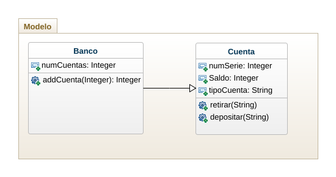

# Parcial2_POO

## Problema
En un banco se tienen varios tipos de cuentas bancarias en las cueales es posible retirar fondos y hacer depósitos. Consideremos 3 tipos de cuentas: cuenta corriente, de ahorro y libreta 2022. Lascuentas corrientes se utilizan para realizar pagos y no proporcionan ningún interés. Por otro lado, las cuentas de ahorro proporcionan un intereés del 4%. La libreta 2022 es un tipo de cuenta de ahorro que rinde un mayor interés (del 8%) pero la reitrada de fondos está penalizada con un 2% de la cantidad retirada.

## Diagrama de clases
